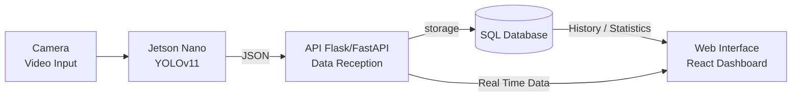

# SmartLiveStock – Real-Time Sheep Counting

This project aims to detect and count sheep in real time using computer vision, supported by a graphical interface. The system uses AI models to recognize sheep in live video, processes the data on an embedded device, and displays the results through a web interface.

## Requirements

Before you start coding, make sure to install the following Python packages:

```bash
pip install ultralytics
pip install opencv-python
pip install numpy==1.26.4
```

> **Note:** The `numpy` version is fixed to ensure compatibility with the libraries used in this project.


## Technologies Used

* Python
* OpenCV
* NumPy
* Ultralytics (YOLOv11)
* NVIDIA Jetson Nano _not yet implemented_
* Web Interface _not yet implemented_

> **Tip:** For testing on a laptop with an NVIDIA GPU, make sure to activate CUDA to use GPU acceleration.

```bash
pip uninstall torch torchvision torchaudio
pip install torch torchvision torchaudio --index-url https://download.pytorch.org/whl/cu118
```

## Project Goal

Detect and count sheep in real time from a video feed using the YOLOv11 model fine-tuned to detect only sheep. The processed data is sent to a server and displayed through a user-friendly web interface.

## Project Structure

```
smartlivestock/
│
├── data/             # Testing videos
├── models/           # YOLO model file
├── results/          # Test results
│   │
│   ├── ids/          # CSV files with sheep IDs
│   ├── logs/         # CSV files with processing data
│   └── plots/        # PNG with plots
│
├── src/              # Main source code (detection, counting, communication)
├── web/              # Web interface code
└── README.md         # This file
```





[//]: # (## Contributions)

[//]: # ()
[//]: # (Feel free to open issues, suggest improvements, or submit pull requests.)

[//]: # (Let’s build something useful together!)